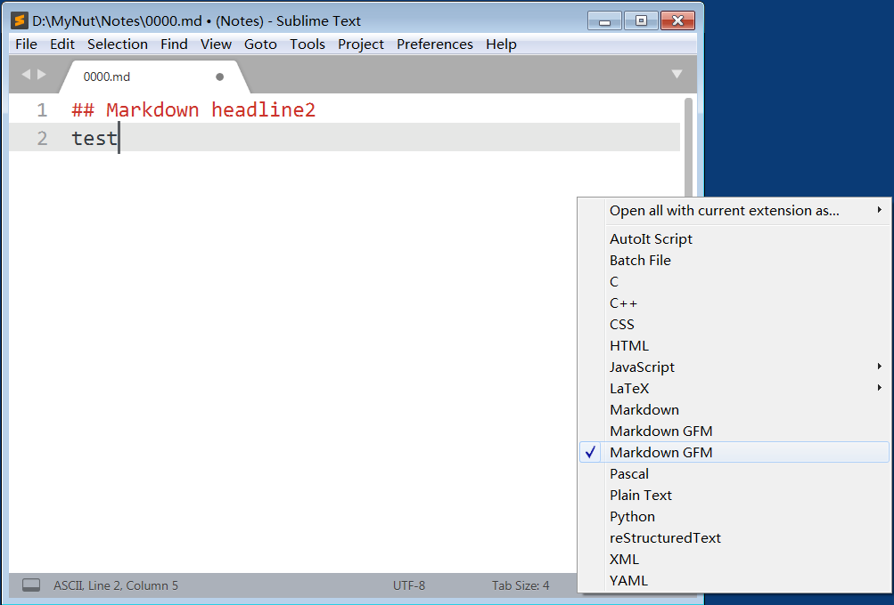

[Readme in Chinese is here](README_CN.md) [中文说明在此](README_CN.md)

## Introduce
**MarkdownWriter** is a Sublime Text 3 (windows) plugin that make markdown text writing more easy.


## you can use it to do:
1. **smart paste**
<br>(1) When you take note from web, you can copy some content in web browser (such as Firefox), then use shortcut <kbd>Ctrl</kbd>+<kbd>Alt</kbd>+<kbd>V</kbd> (or click `Paste html or image` in contextmenu) to paste content in Markdown format into Sublime Text. If it has images in the content, it will auto download the image to local sub directory "media folder".
<br>(2) When you copy some images in local harddisk, you can use shortcut <kbd>Ctrl</kbd>+<kbd>Alt</kbd>+<kbd>V</kbd> to insert the image links in Markdown format in Sublime Text, also the images will be stored into local sub directory "media folder".
<br>(3) When you open one image, you can copy the image picture, then use shortcut <kbd>Ctrl</kbd>+<kbd>Alt</kbd>+<kbd>V</kbd> to insert the image link in Markdown format in Sublime Text, also the images will be stored into local sub directory "media folder".

2. **show inline image directly**
You can manually install [MarkdownInlineImages plugin](https://github.com/math2001/MarkdownInlineImages), then use shortcut <kbd>Alt</kbd>+<kbd>I</kbd> to show images directly in Sublime Text.

3. **bold** You can select some content, use shortcut <kbd>Ctrl</kbd>+<kbd>Alt</kbd>+<kbd>B</kbd> to **Bold** it.

4. **italic** You can select some content, use shortcut <kbd>Ctrl</kbd>+<kbd>Alt</kbd>+<kbd>I</kbd> to **Italic** it.

5. **headline2** Put the cursor in one line, use shortcut <kbd>Ctrl</kbd>+<kbd>Alt</kbd>+<kbd>2</kbd> to **add Headline2**.

6. **headline3** Put the cursor in one line, use shortcut <kbd>Ctrl</kbd>+<kbd>Alt</kbd>+<kbd>3</kbd> to **add Headline3**.

7. **headline4**  Put the cursor in one line, use shortcut <kbd>Ctrl</kbd>+<kbd>Alt</kbd>+<kbd>4</kbd> to **add Headline4**.

8. **smart list** When editing lists, you can just press <kbd>Enter</kbd> and this plugin will automatically continue the list. Once the content of the list becomes empty it will stop.


## install
1. manually install: download and unpack to "Sublime Text 3\Data\Packages\"， open file "Sublime Text 3\Data\Packages\User\Package Control.sublime-settings" with sublime text，add 
```
"installed_packages":
    [
        "MarkdownWriter"
    ]
```


## Tips:
1. If you want this plugin work, you should set markdown syntax as "Markdown GFM" which is given in this plugin or [Markdown​Editing](https://packagecontrol.io/packages/MarkdownEditing) 

2. I use Sublime Text 3 x86 version, so I use library `Pillow` x86 version in this plugin. If you use Sublime Text 3 x64 version, you can unpack ["PIL_x64.zip"](lib/PIL_x64.zip) and cover the "PIL" folder.
3. You must install Sublime Text 3 version >= build 3118 to show image directly.